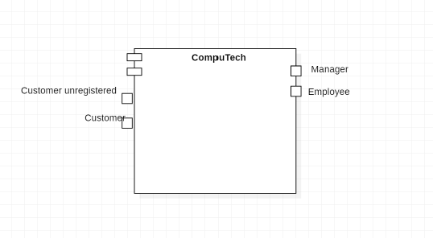
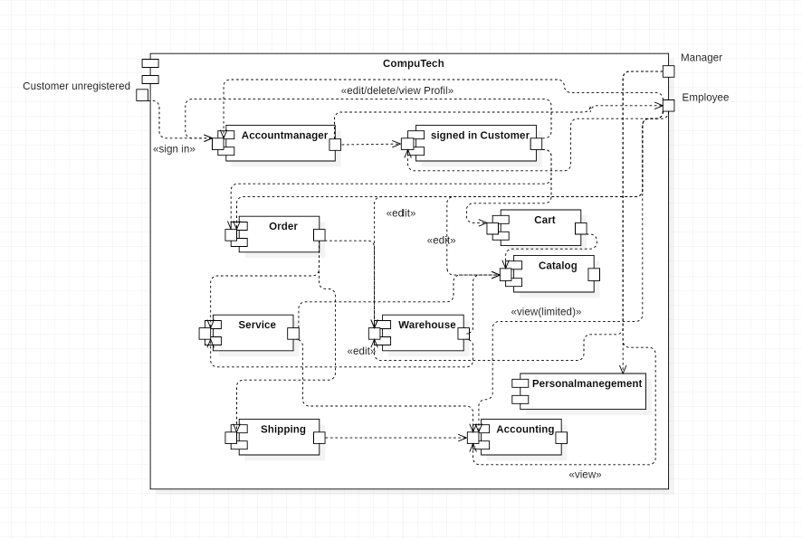
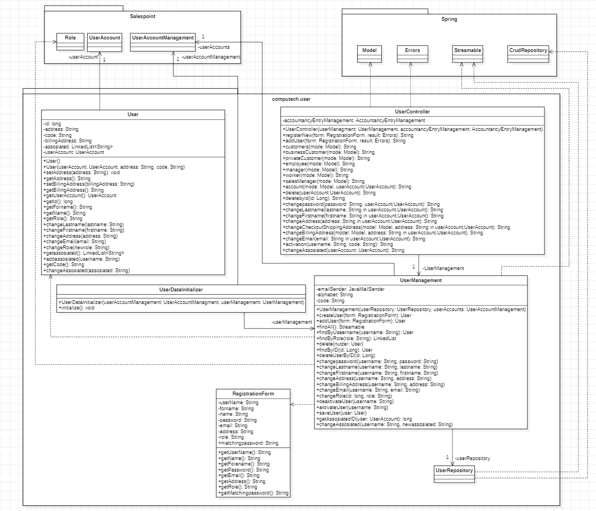
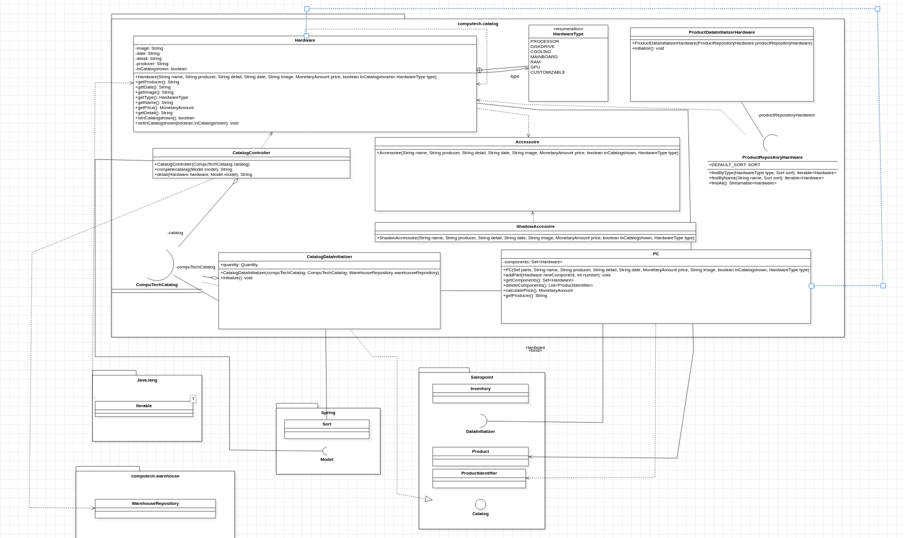
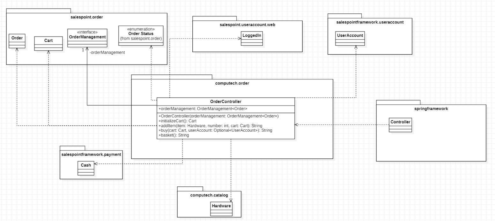
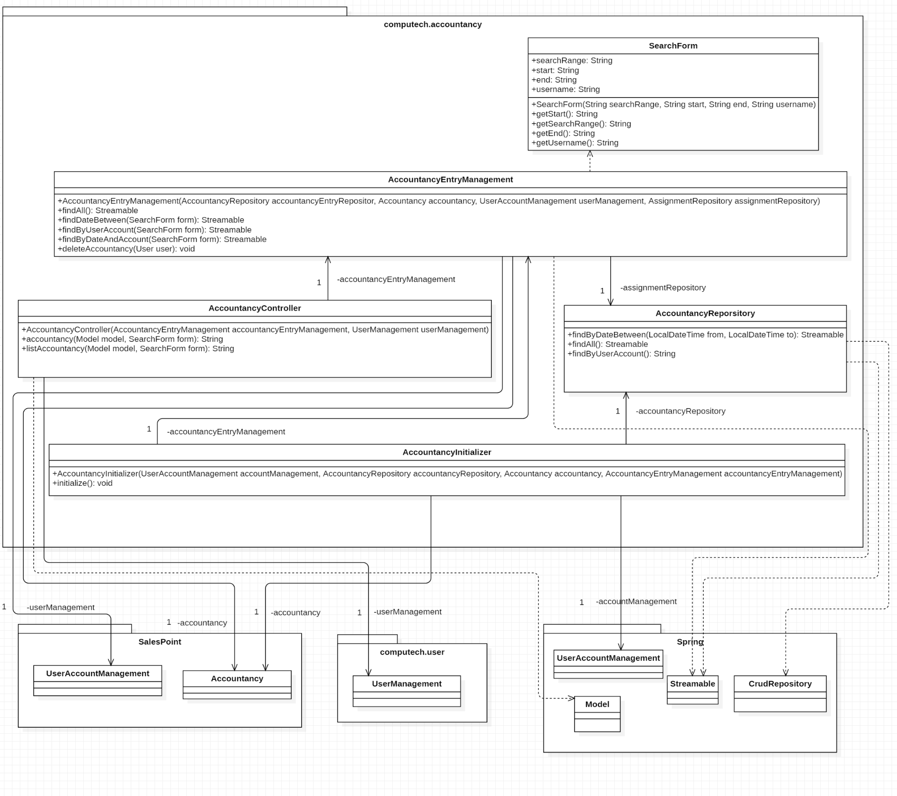
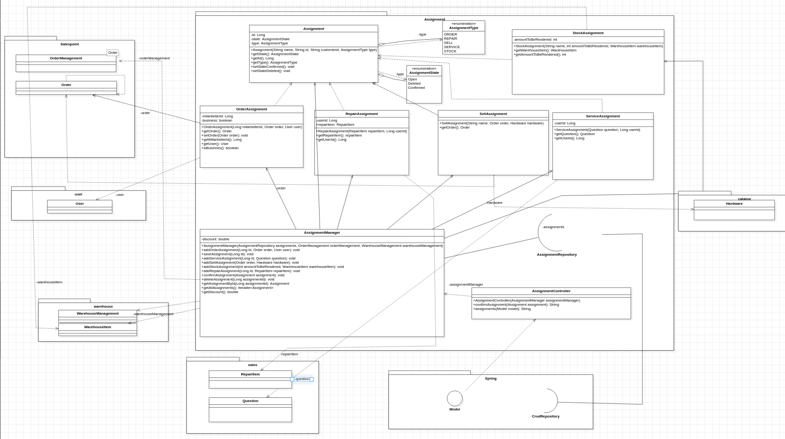
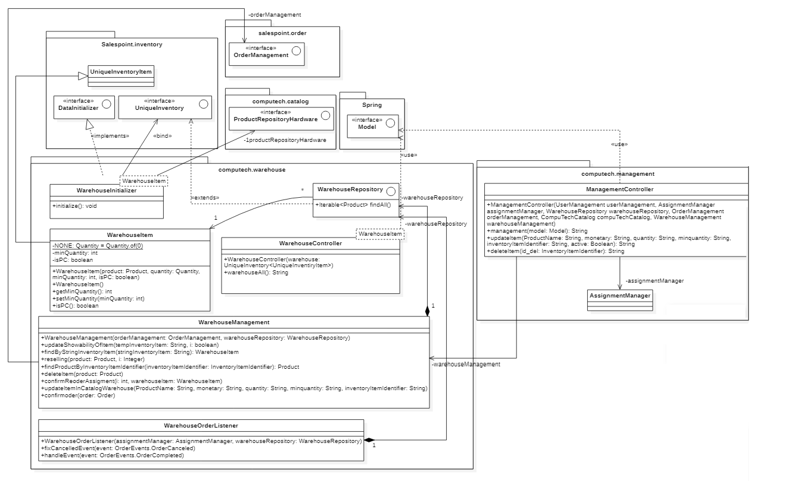
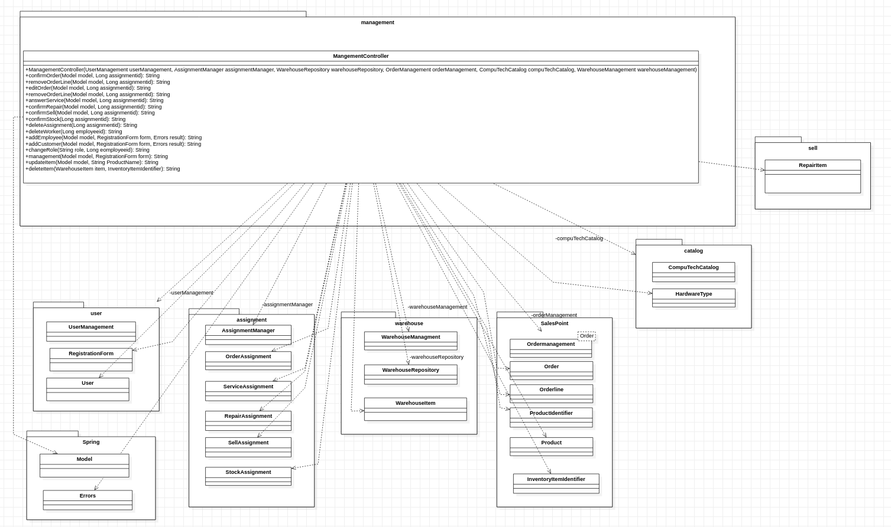
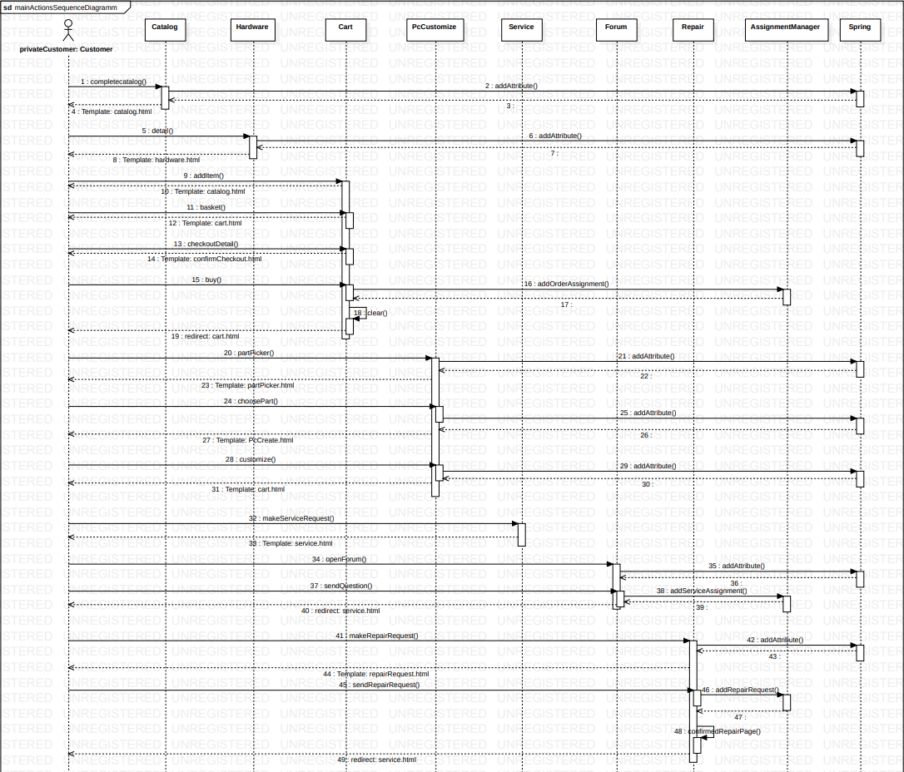

[options="header"]
[cols="1, 3, 3"]
|===
|Version | Bearbeitungsdatum   | Autor 
|1.0	 | 29.11.2020           | Group 5
|===

:project_name: Computech

= Entwicklerdokumentation

== Einführung und Ziele
=== 1.1 Aufgabenstellung

Die Firma (_CompuTech_) beliefert seine Kunden mit PC-Komplettsystemen sowie mit Zubehör und Verbrauchsmaterialien (CDs, Druckerpatronen, Toner,etc.). Die Firma kennt zwei Arten von Kunden(_users_), Privat(_privatecustomer_) -und Geschäftskunden(_businesscustomer_). Geschäftskunden werden von einem Mitarbeiter(_worker_) angelegt und mit einem vorläufigen Kennwort versehen, welches der Kunde(_customer_) danach ändern kann.Des Weiteren wird einbestimmter Verkaufsleiter(_salesmanager_) als Ansprechpartner zugeordnet. Geschäftskunden können, wenn sie angemeldet sind, Bestellungen(_order_) (Erweiterungen von Bestehender Hardware oder Upgrade) aufgeben sowie ihren derzeitigen EDV-Bestand einsehen. In der Bestandsanzeige soll der Kunde Geräte(_product_) auswählen und mit Reparatur-oder Serviceaufträgen versehen können. Privatkunden können sich selbst im System registrieren(_register_). Eine Überprüfung der Email und Postadresse kann helfen die Gültigkeit einer Adresse zu prüfen. Hat sich der Kunde angemeldet so ist es ihm möglich sein, aus einer vorgegebenen Auswahl von Geräten(_catalog_) ein Basismodell auszuwählen und dieses nach seinen Wünschen zu konfigurieren. Zudem soll es die Möglichkeit geben gebrauchte Geräte wieder an CompuTech verkaufen zu können. Ein Verkaufsleiter entscheidet, zu welchem Preis Geräte zurückgekauft werden. Dem Kunden ist es besonders wichtig, dass seine Geschäftsprozesse von dem zu entwickelnden IT-System vollständig abgebildet werden. Keine Aktion geschieht ohne Auftrag! Der Verkaufsleiter nimmt eingehenden Bestellungen und Serviceanfragen entgegen prüft diese und erstellt dann einen Auftrag an das Lager(_warehouse_) und den Service. Das Lager verwaltet den Bestand aller Geräte und Verbrauchsmaterialien. Für alle Posten gibt es Mindestbestände. Werden diese unterschritten, bestellt das Lager automatisch nach. Geht ein Auftrag von einem Verkaufsleiter ein, stellt das Lager die Bestellung zusammen (Kommissionierung) und erstellt dann einen Auftrag für den Versand, welcher sich dann um Auslieferung und Aufstellung der Geräte kümmert. Für den letzten Punkt muss ein Auftrag für den Service erstellt werden. Das System soll zudem ein „Kassenbuch“ führen, welches die Buchhaltung und den Jahresabschluss vereinfachen soll. Hierzu sollen alle Transaktionen gespeichert und nach bestimmten Filterkriterien gedruckt werden können. Auf diese Daten hat nur der Geschäftsführer und die Buchhaltung Zugriff.

=== 1.2 Qualitätsziele

Um die Qualität der Anwendung zu überprüfen werden verschiedene Qualitätsziele definiert die erfüllt werden müssen.

Funktionalität::
Beschreibt im Allgemeinen ob die im System implementierten Funktionen unter bestimmten Bedingungen und Anforderungen funktionieren.

Sicherheit::
Beschreibt ob im System vetrauliche Daten nur von Nutzern, die die richtige Authorisierung sowie den entsprechenden Status haben, eingesehen werden können.

Leistung::
Zeigt bei welchem Grad sich bestimmte Anforderungen auf die Leistungsfähigkeit des Systems auswirken.

Zuverlässigkeit::
Beschreibt ob die Prozesse des Benutzers in Abhängigkeit von Zeit und Verlässlichkeit dementsprechend ausgeführt werden.

Bedienerfreundlichkeit::
Zeigt bis zu welchem Grad die Benutzderoberfläche einfach und angehnem, sowie für den Bediener und dessen Anforderungen zufriedenstellend ist.

Wartbarkeit::
Beschreibt ob im System Änderungen und Reperaturen vorgenommen werden können ohne die Funktionalität und Prozesse des Benutzers einzuschränken.

1 = Nicht Wichtig
5 = Sehr Wichtig
[options="header", cols="3h, ^1, ^1, ^1, ^1, ^1"]
|===
|Qualitätsanforderungen   | 1 | 2 | 3 | 4 | 5
|Funktionalität           |   |   |   |   | x
|Sicherheit               |   | x |   |   |
|Leistung                 |   |   | x |   |
|Zuverlässigkeit          |   |   |   |   | x
|Bedienerfreundlichkeit   |   |   | x |   |
|Wartbarkeit              |   |   |   | x |
|===

== 2. Randbedingungen
=== 2.1 Hardware-Vorgaben
* Prozessor: 4 Kerne 2GHz, Ram: 4GB, Festplatte: 128GB

* Computer

* Tastatur

* Maus

=== 2.2 Software-Vorgaben
Die folgende (oder eine neuere) Java-Version ist zur Ausführung der Anwendung erforderlich:

* Java 11

Die folgenden (oder neuere) Browserversionen sind für die Nutzung der Anwendung erforderlich:

* Google Chrome 87.0

* FireFox 83.0

=== 2.3 Vorgaben zum Betrieb der Software
Das System soll ein Online-Shop für CompuTech werden, damit sie dort ihre Pc-Systeme und Zubehöre an Privat- und Geschäftskunden vertreiben können. Die Software soll auf einem Server laufen und über einen Browser zugängig sein.

Die primeren Nutzer sind sowohl die Kunden als auch die Angestellten von CompuTech. Für die Kunden soll sich das System als Verkaufsspaltform präsentieren und als solches von ihnen genutzt werden. Die Mitarbeiter sollen es als Management-Tool nutzen und somit das Lager und weitere Prozesse verwalten.

== 3. Kontextabgrenzung
=== 3.1 Kontextdiagramm

== 4. Lösungsstrategie
=== 4.1 Erfüllung der Qualitätsziele

Die Folgende Tabelle zeigt die Qualitätsanforderungen und die Lösungsstrategien die angewendet wurden um diese zu erfüllen.
[options="header"]
|=== 
|Qualitätsziel |Lösungsansatz
|Funktionalität a|
* *Fertigstellung* Die Funktionen werden ausreichend fertiggestellt sein um die Anforderungen des Benutzers zu erfüllen.
* *Korrektheit* Es wird sichergestellt das die Funktionen im System die Aufgaben richtig ausführen und bearbeiten.
|Sicherheit a|
* *Vertraulichkeit* Daten können nur von Nutzern, die sich vorher registriert und angemeldet haben, eingesehen werden.
* *Schutz* Passwörter werden in der Datenbank verschlüsselt gespeichert. Mitarbeiter können diese nicht einsehen.
|Leistung a|
* *Effizienz* Die Effizienz des Systems wird durch eine steigende Anzahl an Kunden und Anforderungen in der Datenbank nicht beeinflusst.
|Zuverlässigkeit a|
* *Verfügbarkeit* Für Kunden und deren Anforderungen ist die Webanwendung jederzeit verfügbar.
|Bedienerfreundlichkeit a|
* *Übersichtlichkeit* Durch ein modernes Layout wird sichergestellt das die Seite übersichtlich ist und jedem Kunden ein einfaches Bedienen ermöglicht.
* *Hilfe* Der Benutzer wird durch Hilfestellungen auf fehlerhafte Eingabe hingewiesen. Dadurch werden dem System keine falschen Daten übermittelt.
|Wartbarkeit a|
* *Änderungen* Die Kundendatenbank wird nicht beeinflusst, wenn im System Änderungen vorgenommen werden.
|===

=== 4.2 Softwarearchitektur
* Beschreibung der Architektur anhand der Top-Level-Architektur oder eines Client-Server-Diagramms

_Top Level Architektur von Computech_

=== 4.3 Entwurfsentscheidungen
System entschpricht verschiedene Anfordurungen durch folgende Struktur. +
1. _Data layer_ entschpricht Spring Data Repositories. +
2. _Service Logik_ funktioniert durch verschiedene Management Klassen. +
3. _WebControllern_ bekommen entschprechende Web requests und liefern Views zurück.

=== 4.3.1 Verwendete Muster
* MVC
* Observer
    ** Subject-Order
    ** Observer-WarehouseEventListener

* Composite
    ** Hardware - Component
    ** PC - Composite
    ** Accessoire - Leaf
* (Enumeration) State
    ** State - AssigmentState

=== 4.3.2 Persistenz
Mit Hibernate/JPA kann die Persistenz unserer Anwendung in application.properties an und aus geschaltet werden. +
Dies führt zur Erzeugung einer auslesbaren Datei, die den aktuellen Stand der Datenbanken protokolliert.

=== 4.3.3 Benutzeroberfläche
image::models/analysis/images/Benutzeroberflächer01.png[]
=== 4.4 Verwendung externer Frameworks

[options="header", cols="1,2"]
|===
|Externes Package |Verwendet von (Klasse der eigenen Anwendung)
|salespointframework.catalog a|
* sales.SaleItem
* catalog.Hardware.java
* catalog.PC
* catalog.CompuTechCatalog
* management.ManagementController
|salespointframework.core a|
* sales.SalesController
* catalog.ProductDataInitializerHardware
* user.UserDataInitializer
* warehouse.WarehouseInitializer
* catalog.Hardware.java
* catalog.CatalogDataInitializer
* acountancy.AccountancyController
* acountancy.AccountancyInitializer
|salespointframework.inventory a|
* warehouse.WarehouseInitializer
* warehouse.WarehouseController
* management.ManagementController
|salespointframework.order a|
* sales.SalesController
* customizePC.PcCustomizerController
* acountancy.AccountancyInitializer
* assignment.AssignmentManager
* assignment.OrderAssignment
* assignment.SellAssignment
* management.ManagementController
|salespointframework.payment a|
* sales.SalesController
* acountancy.AccountancyInitializer
* management.ManagementController
|salespointframework.quantity a|
* sales.SalesController
* customizePC.PcCustomizerController
* catalog.CatalogDataInitializer
* warehouse.WarehouseController
|salespointframework.SalespointSecurityConfiguration a|
* computech.Application
|salespointframework.time |
|salespointframework.useraccount a|
* sales.SalesController
* sales.SalesController
* sales.RepairController
* user.UserManagement
* user.User
* user.UserDataInitializer
* user.UserController
* acountancy.AccountancyEntryManagement
* acountancy.AccountancyInitializer
* acountancy.AccountancyRepository
|salespointframework.accountancy a|
* acountancy.AccountancyController
* acountancy.AccountancyEntryManagement
* acountancy.AccountancyInitializer
* acountancy.AccountancyRepository
|springframework.boot a|
* computech.Application
|springframework.core a|
* user.UserDataInitializer
|springframework.data a|
* sales.ServiceRepository
* sales.RepairRepository
* sales.RepairItem
* sales.Question
* catalog.CompuTechCatalog
* user.UserRepository
* user.UserManagement
* acountancy.AccountancyController
* acountancy.AccountancyEntryManagement
* acountancy.AccountancyInitializer
* acountancy.AccountancyRepository
* assignment.AssignmentRepository
* catalog.ProductRepositoryHardware
|springframework.stereotype a|
* sales.SalesController
* sales.SalesController
* sales.RepairController
* customizePC.PcCustomizerController
* catalog.ProductDataInitializerHardware
* warehouse.WarehouseController
* controller.WelcomeController
* catalog.CatalogDataInitializer
* catalog.CatalogController
* user.UserDataInitializer
* user.UserManagement
* user.UserController
* acountancy.AccountancyController
* acountancy.AccountancyEntryManagement
* acountancy.AccountancyInitializer
* assignment.AssignmentController
* assignment.AssignmentManager
* management.ManagementController
|springframework.security a|
* sales.SalesController
* sales.SalesController
* sales.RepairController
* customizePC.PcCustomizerController
* computech.Application
* warehouse.WarehouseController
* user.UserController
* acountancy.AccountancyController
* assignment.AssignmentManager
* management.ManagementController
|springframework.ui a|
* sales.SalesController
* sales.SalesController
* sales.RepairController
* customizePC.PcCustomizerController
* warehouse.WarehouseController
* controller.WelcomeController
* catalog.CatalogController
* user.UserController
* acountancy.AccountancyController
* assignment.AssignmentController
* management.ManagementController
|springframework.util a|
* user.UserDataInitializer
* catalog.CatalogDataInitializer
|springframework.validation a|
* customer.CustomerController
* catalog.CatalogController
* user.UserController
* management.ManagementController
|springframework.web a|
* sales.SalesController
* sales.SalesController
* sales.RepairController
* customizePC.PcCustomizerController
* warehouse.WarehouseController
* controller.WelcomeController
* catalog.CatalogController
* user.UserController
* acountancy.AccountancyController
* assignment.AssignmentController
* management.ManagementController
* assignment.AssignmentManager
|springframework.context a|
* computech.Application
* assignment.AssignmentManager
|javamoney.moneta a|
* catalog.Hardware.java
* catalog.CatalogDataInitializer
* management.ManagementController
|slf4j a|
* catalog.CatalogDataInitializer
* user.UserDataInitializer
|javax.money a|
* sales.SalesController
* sales.SaleItem
* catalog.PC
* catalog.Accessoire
* catalog.Hardware
* acountancy.AccountancyController
* catalog.ShadowAccessoire
|javax.validation a|
* acountancy.AccountancyController
* user.UserController
|javax.transaction a|
* acountancy.AccountancyEntryManagement
* user.UserManagement
|javax.persistence a|
* sales.RepairItem
* sales.Question
* catalog.ShadowAccessoire
* catalog.PC
* catalog.Hardware
* catalog.Accessoire
* user.User
* user.UserController
* assignment.Assignment
* assignment.OrderAssignment
* assignment.RepairAssignment
* assignment.SellAssignment
* assignment.ServiceAssignment
* assignment.StockAssignment
|springframework.beans.factory.annotation.Autowired|user.UserManagment
|springframework.mail|user.UserManagment
|java.util.Linkedlist a|
* sales.SalesController
* user.User
* user.UserController
|java.util.Random a|
* user.UserManagement
* user.UserManagment
* user.UserController
|java.util.List a|
* user.UserDataInitializer
|java.util.Optional|user.UserManagement
|java.time a|
* acountancy.AccountancyEntryManagement
* acountancy.AccountancyRepository
|lombok a|
* acountancy.SearchForm
|java.util a|
* catalog.ProductDataInitializerHardware
* customizePC.PcCustomizerController
* sales.RepairController
* sales.SalesController

|===

== 5. Bausteinsicht
=== 5.1 Benutzer(User)

[options="header"]
|===
|Klasse/Enumeration |Description
|UserController|Sprig nutzender Controller um Nuter(User) zu registrieren
|UserManager|Verwaltet die Nutzer
|User|Beinhaltet die zusätzlichen Nutzerdaten Addresse, Vorname und Nachname, sowie den aus Salespoint stammenden UserAccount
|UserRepository|Ein Repository um die Nutzer Instanzen aufzubewahren
|UserDataInitializer|Erstellt einen standart Boos Account
|RegistrationForm|Ein Interface um die Nutzer eingaben für die Registrierung zu validieren
|===

=== 5.2 Katalog(catalog)

[options="header"]
|===
|Klasse/Enumeration |Description
|CatalogController| stellt den Nutzer alle Produkte dar, Nutzer kann Produkte auch detailliert anzeigen lassend, alles basierend auf Spring
|===

=== 5.3 Order

[options="header"]
|=== 
|Klasse/Enumeration |Description
|OrderController|Ein auf Spring aufbauender Controller, um ein Cart zu erstellen, Items zum Cart hinzuzufügen, und eine Order mit dem Bezahlvorgang zu beenden
|===

=== 5.4 Finanzen(CashBook)

[options="header"]
|===
|Klasse/Enumeration |Description
|CashBookController | Ein auf Spring nutzender Controller, um auf die Finanzen Zugreifen zu können
|===
=== 5.5 Zuordnung(assignment)

[options="header"]
|===
|Klasse/Enumeration |Description
|AssignmentController |Protokolliert und kontrolliert alle Aufgaben der Applikation
|===

=== 5.6 Lagerhaus (warehouse)

[options="header"]
|===
|Klasse/Enumeration |Description
|WarehouseController | Controller um eine Liste der Objekten in Repo zu betracten
|WarehouseRepository | Speichert alle Lagerwaren.
|WarehouseItem | Erweiterte UniqueInventoryItem von Salespoint Framework
|WarehouseManagement | Methoden um Warehouse Repository zu bearbeiten
|WarehouseInitializer | Erstellt einfache objekten für Repo
|WarehouseOrderListener | Hört events von Order management
|ManagementController | Bekommt requests um Items im Lager zu bearbeiten
|UniqueInventoryItem | Basic WarehouseItem
|===

=== 5.7 Management(management)

[options="header"]
|===
|Klasse/Enumeration |Description
|ManagementController | Verbindet Warehouse und Assignments
|===

=== 5.8 Rückverfolgbarkeit zwischen Analyse- und Entwurfsmodell
_Die folgende Tabelle zeigt die Rückverfolgbarkeit zwischen Entwurfs- und Analysemodell. Falls eine Klasse aus einem externen Framework im Entwurfsmodell eine Klasse des Analysemodells ersetzt,
wird die Art der Verwendung dieser externen Klasse in der Spalte *Art der Verwendung* mithilfe der folgenden Begriffe definiert:_

* Inheritance/Interface-Implementation
* Class Attribute
* Method Parameter

[options="header"]
|===
|Klasse/Enumeration (Analysemodell) |Klasse/Enumeration (Entwurfsmodell) |Art der Verwendung
|ShippingFactory                    |assignment.AssignmentManager        |Method Parameter
|ServiceFactory                     |assignment.AssignmentManager        |Method Parameter
|ItemExchangeFactory                |assignment.AssignmentManager        |Method Parameter
|CreateRecipeFactory                |accountancy.Accountancy             |
|CashBook                           |accountancy.Accountancy             |
|ShippingAssignment                 |AssignmentManager.confirmAssignment |
|Order                              |Salespoint.Order                    |Method Parameter
|Ordereditems                       |Salespoint.Orderline                |Method Parameter
|OrderManager                       |Salespoint.OrderManager<Order>      |Method Parameter
|Cart                               |Salespoint.Cart(via Salespoint.Order)|Method Parameter
|Cartitem                           |Salespoint.CartItem                 |Method Parameter
|Product                            |Salespoint.Product (via Catalog.Hardware)|Inheritance
|Case/Cpu/Harddrive/RAM/Mainboard/Fan|catalog.HardwareType               |
|Pc/Accessoires                     |components                          |Class Attribute
|Accessoires                        |Accessoire                          |
|User                               |Salespoint.User                     |Inheritance
|Employee/Customer                  |Salespoint.UserAccount.Role         |
|Stock                              |Salespoint.OrderManagement          |Class Attribute
|Warehouse                          |computech.Warehouse                 |
|InventoryItem                      |Salespoint.UniqueInventoryItem (via warehouse.WarehouseItem)|Inheritance
|ItemExchange                       |warehouse.WarehouseManagement       |
|Assignment                         |assignment.Assignment               |
|Service                            |assignment.ServiceAssignment        |
|ServicType.Repair                  |assignment.RepairAssignment         |
|ServiceType.Resale                 |assignment.SellAssignment           |
|ServiceWorkshop                    |assignment.AssignmentManager        |
|ServiceObserver                    |assignment.AssignmentManager        |Method Parameter
|Observer                           |assignment.AssignmentManager        |Method Parameter (via confirmAssignment)
|MediatorWarehouseService           |assignment.AssignmentManager        |Method Parameter (via confirmAssignment)
|Catalog                            |Salespoint.Catalog                  |Interface-Implementation
|CashBook                           |accountancy.Accountancy             |
|Recipt                             |Spring.CrudRepository               |Interface-Implementation
|CompuTech                          |computech.Application               |
|Shipping                           |AssignmentManager.confirmAssignment |Method Parameter
|WorkerType                         |Salespoint.UserAccount.Role         |Method Parameter
|WarehouseObserver                  |warehouse.WarehouseOrderListener    |
|Transaction                        |accountancy.AccountancyEntryManagment|Method Parameter

|===

== 6. Laufzeitsicht

* Darstellung der Komponenteninteraktion anhand eines Sequenzdiagramms, welches die relevantesten Interaktionen darstellt.

== 7. Technische Schulden
* Auflistung der nicht erreichten Quality Gates und der zugehörigen SonarQube Issues zum Zeitpunkt der Abgabe

|===
|Critical issues | Beschreibung | Kommentar
|OrderController(116)| Refactor this method to reduce its Cognitive Complexity from 16 to the 15 allowed| Komplexität ist nur eins über dem Limit und es ist unser einziges Critical Issue
|===

|===
|Major issues | Beschreibung | Kommentar
|managementController(357) | Refactor this code to not nest more than 3 if/for/while/switch/try statements |
|===
