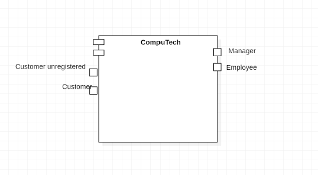
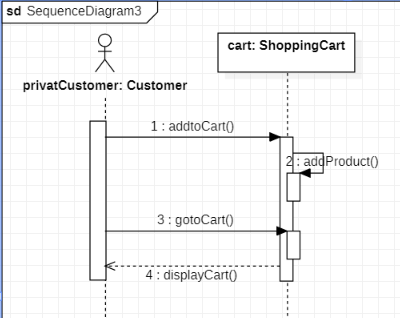
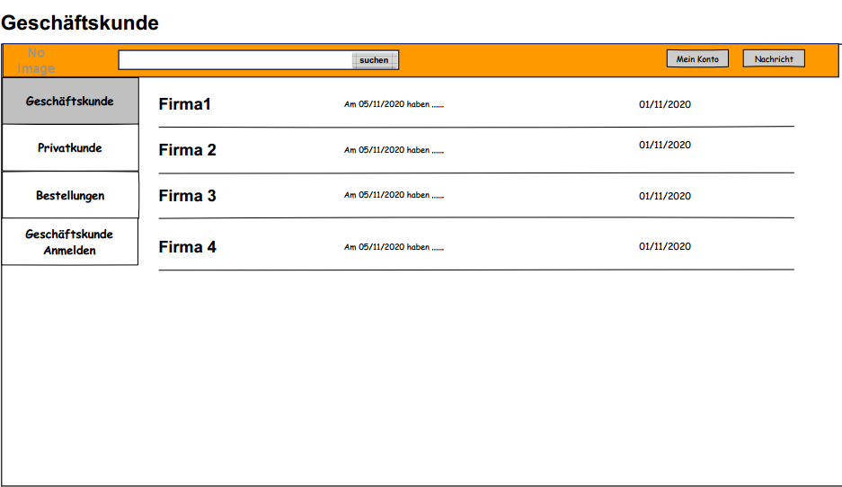

= Pflichtenheft
:project_name: IT-Webshop

== __{project_name}__

[options="header"]
[cols="1, 1, 1, 1, 4"]
|===
|Version | Status      | Bearbeitungsdatum   | Autoren(en) |  Vermerk
|0.1     | In Arbeit   | 10.10.2020          | Autor       | Initiale 
|0.2     | In Arbeit   | 15.11.2020          | Gruppe 5    | -
|===

== 0. Inhaltsverzeichnis
1. Zusammenfassung
2. Aufgabenstellung und Zielsetzung
3. Produktnutzung
4. Interessensgruppen (Stakeholders)
5. Systemgrenze und Top-Level-Architektur
6. Anwendungsfälle
7. Funktionale Anforderungen
8. Nicht-Funktionale Anforderungen
9. GUI Prototyp
10. Datenmodell
11. Akzeptanztestfälle
12. Glossar
13. Offene Punkte

== 1. Zusammenfassung
_Eine kurze Beschreibung des Dokuments. Wenige Absätze._

Dieses Dokument repräsentiert die pflichten des Projektes {project_name}. Das Ziel ist es einen Überblick über die geplante Software und deren Funktionen als Kommunikation zwischen Nutzer und Entwickler zu verschaffen.
Dieses Dokument legt die Bedingungen des Vertrages zwischen Kunde und Auftraggeber fest. Deswegen sollte es bestätigt und auf Konsistenz geprüft sein. Das Pflichtenheft beschreibt was die geplante Software liefern muss und wie der Auftraggeber diese dann implementiert.

Das Pflichtenheft sollte Korrekt, Komplett und Konsistent sein. Da es am Ende als Nachweis genutzt wird, ob die definierte Software der gelieferten Software entspricht, muss das Pflichtenheft diese Bedingungen erfüllen. Es wird während des ganzen Projektes genutzt und hinzugezogen, weswegen die Inhalte dauerhaft zu jedem Zeitpunkt nachvollziehbar sein sollten. Es ist gut, wenn Veränderungen und Entwicklungen einfach nachvollziehbar sind, obwohl man diese so gering wie möglich halten sollte, nachdem die Akteure einmal zugestimmt haben. Durch wechselnde Anforderungen und Umstände werden trotzdem Änderungen zu erwarten sein. 

== 2. Aufgabenstellung und Zielsetzung

Die Firma CompuTech beliefert seine Kunden mit PC-Komplettsystemen sowie mit Zubehör und Verbrauchsmaterialien (CDs, Druckerpatronen, Toner,etc.). Die Firma kennt zwei Arten von Kunden, Privat -und Geschäftskunden(B2C & B2B). Geschäftskunden werden von einem Mitarbeiter angelegt und mit einem vorläufigen Kennwort versehen, welches der Kunde danach ändern kann.Des Weiteren wird einbestimmter Verkaufsleiter als Ansprechpartner zugeordnet. Geschäftskunden können, wenn sie angemeldet sind, Bestellungen (Erweiterungen von Bestehender Hardware oder Upgrade) aufgeben sowie ihren derzeitigen EDV-Bestand einsehen. In der Bestandsanzeige soll der Kunde Geräte auswählen und mit Reparatur-oder Serviceaufträgen versehen können. Privatkunden können sich selbst im System registrieren. Eine Überprüfung der Email und Postadresse kann helfen die Gültigkeit einer Adresse zu prüfen. Hat sich der Kunde angemeldet so ist es ihm möglich sein, aus einer vorgegebenen Auswahl von Geräten ein Basismodell auszuwählen und dieses nach seinen Wünschen zu konfigurieren. Zudem soll es die Möglichkeit geben gebrauchte Geräte wieder an CompuTech verkaufen zu können. Ein Verkaufsleiter entscheidet, zu welchem Preis Geräte zurückgekauft werden. Dem Kunden ist es besonders wichtig, dass seine Geschäftsprozesse von dem zu entwickelnden IT-System vollständig abgebildet werden. Keine Aktion geschieht ohne Auftrag! Der Verkaufsleiter nimmt eingehenden Bestellungen und Serviceanfragen entgegen prüft diese und erstellt dann einen Auftrag an das Lager und den Service. Das Lager verwaltet den Bestand aller Geräte und Verbrauchsmaterialien. Für alle Posten gibt es Mindestbestände. Werden diese unterschritten, bestellt das Lager automatisch nach. Geht ein Auftrag von einem Verkaufsleiter ein, stellt das Lager die Bestellung zusammen (Kommissionierung) und erstellt dann einen Auftrag für den Versand, welcher sich dann um Auslieferung und Aufstellung der Geräte kümmert. Für den letzten Punkt muss ein Auftrag für den Service erstellt werden. Das System soll zudem ein „Kassenbuch“ führen, welches die Buchhaltung und den Jahresabschluss vereinfachen soll. Hierzu sollen alle Transaktionen gespeichert und nach bestimmten Filterkriterien gedruckt werden können. Auf diese Daten hat nur der Geschäftsführer und die Buchhaltung Zugriff.

Ein neues IT-System soll die Beziehung zum Kunden vereinfachen und einen Wettbewerbsvorteil für seine Geschäftskunden bieten.

== 3. Produktnutzung
In welchem Kontext soll das System später genutzt werden? Welche Rahmenbedingungen gelten?
Zusätzlich kurze Einleitung für fachfremde Personen

Das System soll ein Online-Shop für CompuTech werden, damit sie dort ihre Pc-Systeme und Zubehöre an Privat- und Geschäftskunden vertreiben können.
Die Software soll auf einem Server laufen und über einen Browser zugängig sein.

Die primeren Nutzer sind sowohl die Kunden als auch die Angestellten von CompuTech.
Für die Kunden soll sich das System als Verkaufsspaltform präsentieren und als solches von ihnen genutzt werden.
Die Mitarbeiter sollen es als Management-Tool nutzen und somit das Lager und weitere Prozesse verwalten.

== 4. Interessensgruppen (Stakeholders)
Welche realen und juristischen Personen(-gruppen) haben Einfluss auf die Anforderungen im Projekt?
In der nachfolgenden Tabelle sind die Interessengruppen, eine kurze Beschreibung zu ihnen und ihre Ziele aufgeführt.

[options="header", cols="2, 4, 4"]
|===
|Name
|Description
|Goals

|Computech
|Der Auftraggeber
a|
- möchte seine Ware online vertreiben
- möchte den Verkaufsprozess automatisieren

|Manager
|Manager von Computech
a|
- wollen alles einfach einsehen und bearbeiten können

|Verkaufsmanager
|Managed den Verkauf
a|
- Jede Bestellung überprüfen
- Geschäftskunden betreuen

|Finanzabteilung
|Zuständig für die Finanzen der Firma
a|
- Zugriff und Darstellung von Rechnungen

|Geschäftskunden
|Zielkunde der Platform
a|
- gute und einfache Nutzung
- eine individuelle Betreuung

|Privatkunden
|nicht kommerziell agierende Kunden
a|
- gute und einfache Nutzung

|===

== 5. Systemgrenze und Top-Level-Architektur

=== Kontextdiagramm
Das Kontextdiagramm zeigt das geplante Software-System in seiner Umgebung. Zur Umgebung gehören alle Nutzergruppen des Systems und Nachbarsysteme. Die Grafik kann auch informell gehalten sein. Überlegen Sie sich dann geeignete Symbole. Die Grafik kann beispielsweise mit Visio erstellt werden. Wenn nötig, erläutern Sie diese Grafik.

=== Top-Level-Architektur
Dokumentieren Sie ihre Top-Level-Architektur mit Hilfe eines Komponentendiagramm.

image::models/analysis/images/Top-Level-Architektur_final2.png[]

== 6. Anwendungsfälle

=== Akteure

_Akteure sind die Benutzer des Software-Systems oder Nachbarsysteme, welche darauf zugreifen. Dokumentieren Sie die Akteure in einer Tabelle. Diese Tabelle gibt einen Überblick über die Akteure und beschreibt sie kurz. Die Tabelle hat also mindestens zwei Spalten (Akteur Name und Kommentar).
Weitere relevante Spalten können bei Bedarf ergänzt werden._

// See http://asciidoctor.org/docs/user-manual/#tables
[options="header"]
[cols="1,4"]
|===
|Name |Beschreibung
|unregistered User  | alle Personen, die noch keinen Account haben
|Customer | eingeloggter Kunde, kein Unterschied zwischen Geschäftskunde oder Privatkunde
|Worker | normaler Mitarbeiter
|sales Manager | Verantwortlich für Service und Bestellungen
|accounting departement | für Transaktionen und loggin zuständig
|Boss| Chef des Ladens, hat alle Rechte die zu vergeben sind
|===

=== Überblick Anwendungsfalldiagramm

=== Anwendungsfallbeschreibungen
_Dieser Unterabschnitt beschreibt die Anwendungsfälle. In dieser Beschreibung müssen noch nicht alle Sonderfälle und Varianten berücksichtigt werden. Schwerpunkt ist es, die wichtigsten Anwendungsfälle des Systems zu finden. Wichtig sind solche Anwendungsfälle, die für den Auftraggeber, den Nutzer den größten Nutzen bringen.
Für komplexere Anwendungsfälle ein UML-Sequenzdiagramm ergänzen.
Einfache Anwendungsfälle mit einem Absatz beschreiben.
Die typischen Anwendungsfälle (Anlegen, Ändern, Löschen) können zu einem einzigen zusammengefasst werden._

[cols="1h, 3"]
[[UC0010]]
|===
|ID                         |**<<UC0010>>**
|Name                       |Login/Logout
|Beschreibung               |Ein Nutzer sollte sich einloggen können, um mehr Funktionalität der Website zu haben. Umgedreht sollte er sich auch ausloggen können
|Akteure                     |User
|Auslöser                    |_Login_: Nutzer will mehr Funktionen haben

_Logout_: Nutzer will Shop verlassen
|Bedingungen                 | Login: Nutzer ist noch nicht authentifiziert, Logout: Nutzer ist eingeloggt
|Wichtige Schritte           | _Login:_ Nutzer besucht Login Seite, _Logout_: Nutzer drückt Logout button 
|Erweiterungen               |-
|Funktionale Anforderungen   | <<F0010>>
|===

[cols="1h, 3"]
[[UC0011]]
|===
|ID                         |**<<UC0011>>**
|Name                       |Registrieren
|Beschreibung               | Ein unregistrierter Nutzer sollte sich registrieren können
|Akteure                     | unregistered User
|Auslöser                    | unregistrierter Nutzer will Account erstellen
|Bedingungen                 | Nutzer ist unregistriert
|Wichtige Schritte           | auf Registrieren klicken
|Erweiterungen               |-
|Funktionale Anforderungen   | <<F0020>>
|===

[cols="1h, 3"]
[[UC0020]]
|===
|ID                         |**<<UC0020>>**
|Name                       |Produkte anzeigen
|Beschreibung               |zeigt alle Produkte des IT Shops an
|Akteure                     |User, unregistered USer
|Auslöser                    | Nutzer oder unregistrierter Nutzer besucht Website
|Bedingungen                 | -
|Wichtige Schritte           | URL öffnen um auf IT Shop Seite zu gelangen 
|Erweiterungen               |-
|Funktionale Anforderungen   |-
|===

[cols="1h, 3"]
[[UC0020]]
|===
|ID                         |**<<UC0021>>**
|Name                       | Produkt in Warenkorb legen
|Beschreibung               | Nutzer kann Produkt in Warenkorb legen um es dann später zu kaufen
|Akteure                     |User
|Auslöser                    |Auf in Warenkorb legen Button geklickt
|Bedingungen                 | Nutzer ist eingeloggt
|Wichtige Schritte           | einloggen, Produkt angucken und in Warenkorb legen
|Erweiterungen               |-
|Funktionale Anforderungen   | <<F0033>>
|===

[cols="1h, 3"]
[[UC0030]]
|===
|ID                         |**<<UC0030>>**
|Name                       | Bestellung aufgeben
|Beschreibung               | Ein schließt Bezahlvorgang ab und bestellt dadurch was
|Akteure                     |User
|Auslöser                    | Nutzer hat bezahlt und klickt auf kostenpflichtig bestellen
|Bedingungen                 | Nutzer hat Produkte im Warenkorb
|Wichtige Schritte           | eingeloggter Nutzer sein, Produkte in Warenkorb legen und dann bestellen 
|Erweiterungen               |-
|Funktionale Anforderungen   | <<F0033>>
|===

[cols="1h, 3"]
[[UC0031]]
|===
|ID                         |**<<UC0031>>**
|Name                       |Reperatur- und Serviceanträge stellen
|Beschreibung               | Nutzer kann Formulare für Anträge ausfüllen und absenden
|Akteure                     |User
|Auslöser                    | Nutzer klickt auf Button Reparatur oder Serviceantrag stellen
|Bedingungen                 | Nutzer ist eingeloggt
|Wichtige Schritte           | auf Reperatur- oder Serviceantrag stellen klicken, Formular ausfüllen und absenden
|Erweiterungen               |-
|Funktionale Anforderungen   | <<F0033>>
|===

[cols="1h, 3"]
[[UC0040]]
|===
|ID                         |**<<UC0040>>**
|Name                       |Kontaktperson für Geschäftskunden
|Beschreibung               |Jeder Geschäftskunde besitzt einen Mitarbeiter als Kontaktperson
|Akteure                     |Mitarbeiter, Geschäftskunde
|Auslöser                    | Geschäftskunde hat Fragen
|Bedingungen                 | User ist Geschäftskunde
|Wichtige Schritte           | 
|Erweiterungen               |-
|Funktionale Anforderungen   | <<F0050>>
|===

[cols="1h, 3"]
[[UC0041]]
|===
|ID                         |**<<UC0042>>**
|Name                       |neuen Geschäftskunden anlegen
|Beschreibung               | Ein Geschäftskunde kann nur von einem Mitarbeiter angelegt werden
|Akteure                     |Mitarbeiter
|Auslöser                    | Geschäftskunde möchte sich registrieren lassen
|Bedingungen                 | Geschäftskunde ist wirklich ein Geschäftskunde
|Wichtige Schritte           | als Mitarbeiter einloggen, auf neuen Geschäftskunden anlegen gehen
|Erweiterungen               |-
|Funktionale Anforderungen   | <<F0052>>
|===

[cols="1h, 3"]
[[UC0043]]
|===
|ID                         |**<<UC0043>>**
|Name                       |Service fragen beantworten
|Beschreibung               |Der Verkaufsmanager beantwortet Servicefragen die Kunden gestellt haben 
|Akteure                     |Verkaufsmanager
|Auslöser                    | Kunde hat fragen
|Bedingungen                 | Kunde hat Service anfrage gesendet
|Wichtige Schritte           | als Verkaufsleiter einloggen, auf Servicefragen gehen und diese über ein Formular beantworten
|Erweiterungen               |-
|Funktionale Anforderungen   | <<F0055>>
|===
[cols="1h, 3"]
[[UC0044]]
|===
|ID                         |**<<UC0044>>**
|Name                       |Auftrag für Lager erstellen
|Beschreibung               |Verkaufsleiter erstellt Auftrag fürs Lager
|Akteure                     |Verkaufsleiter
|Auslöser                    | Nutzer hat etwas bestellt
|Bedingungen                 | Verkaufsleiter gibt Bestellung an das Lager weiter
|Wichtige Schritte           | 
|Erweiterungen               |-
|Funktionale Anforderungen   | -
|===
[cols="1h, 3"]
[[UC0045]]
|===
|ID                         |**<<UC0045>>**
|Name                       |Auftrag für Service erstellen
|Beschreibung               | Verkaufsleiter übergibt Serviceantrag dem Service
|Akteure                     | Verkaufsleiter
|Auslöser                    | Nutzer hat Serviceanfrage gestellt
|Bedingungen                 | Serviceantrag wurde vom Verkaufsleiter akzeptiert
|Wichtige Schritte           | 
|Erweiterungen               |-
|Funktionale Anforderungen   | <<F0056>>
|===
[cols="1h, 3"]
[[UC0046]]
|===
|ID                         |**<<UC0046>>**
|Name                       |Kassenbuch führen
|Beschreibung               |nach jeder Bestellung usw wird ein Eintrag ins Kassenbuch geschrieben
|Akteure                     | Buchhaltung 
|Auslöser                    | Nutzer hat was bestellt oder reklamiert
|Bedingungen                 | -
|Wichtige Schritte           | -
|Erweiterungen               |-
|Funktionale Anforderungen   | <<F0300>>
|===
[cols="1h, 3"]
[[UC0047]]
|===
|ID                         |**<<UC0047>>**
|Name                       |Transaktionen auslesen
|Beschreibung               |alle Ereignisse die stattgefunden haben können ausgelesen werden
|Auslöser                    | im System ist etwas passiert
|Bedingungen                 | -
|Wichtige Schritte           | jemand hat zbsp etwas bestellt
|Erweiterungen               |-
|Funktionale Anforderungen   | <<F0301>>
|===
[cols="1h, 3"]
[[UC0050]]
|===
|ID                         |**<<UC0050>>**
|Name                       |neuen Mitarbeiter hinzufügen/ löschen
|Beschreibung               |Der Chef kann bestimmen wer bei ihm arbeiten soll
|Akteure                     |Boss, Mitarbeiter
|Auslöser                    | neuer Mitarbeiter eingestellt/ Mitarbeiter gekündigt
|Bedingungen                 | Boss ist Boss
|Wichtige Schritte           | Boss muss auf Mitarbeiter Verwalten klicken und Mitarbeiter hinzufügen oder herauslöschen
|Erweiterungen               |-
|Funktionale Anforderungen   | <<F0051>>,<<F0052>>
|===
[cols="1h, 3"]
[[UC0051]]
|===
|ID                         |**<<UC0051>>**
|Name                       | Mitarbeiter befördern oder degradieren
|Beschreibung               | Der Chef kann bestimmen welche arbeiter welche Rolle hat
|Akteure                     |Boss, Mitarbeiter
|Auslöser                    | Boss ändert Rang von Mitarbeiter
|Bedingungen                 | -
|Wichtige Schritte           | Boss mus auf Mitarbeiter verwalten klicken und Mitarbeiter neuen Rang vergeben
|Erweiterungen               |-
|Funktionale Anforderungen   | <<K0013>>
|===

== 7. Funktionale Anforderungen

=== Muss-Kriterien
Was das zu erstellende Programm auf alle Fälle leisten muss.
[options="header", cols="2h, 1, 3, 12"]
|===
|ID |Version |Name |Beschreibung

|[[F0010]]<<F0010>>
|v0.1
|Authentifikation
a|
Das System muss in frei verfügbare Bereiche und limitierte Bereiche, die nur mit Auhetifikation erreicht werden können,
unterteilt werden können. Registrierte Nutzer(<<user>>) können sich mit folgen Daten anmelden:

* Benutzername(<<username>>)
* Passwort(<<password>>)

|[[F0020]]<<F0020>>
|v0.1
|Registrierung
a|
Das System gibt einem nicht registrierten Nutzer(<<user_unregistred>>) die Möglichkeit über die Schaltfläfe Registrieren sich anzumelden.
Notwendige Informationen sind:

* Benutzername(<<username>>)
* Passwort(<<password>>)
* Passwortwiederholung(<<password_confirm>>)
* Email-Adresse(<<email>>)
* Adresse(<<adress>>)
* Status(Privat/Geschäft) (<<status>>)

Für den Geschäftkunde(<<status>> == business) muss ein Mitarbeiter die Anmeldung übernehmen. (<<F0051>>)
Notwendige Informationen sind:

* Benutzername(<<username>>)
* Email-Adresse(<<email>>)
* Adresse(<<adress>>)
* Status(Privat/Geschäft) (<<status>>)

|[[F0021]]<<F0021>>
|v0.1
|Registrierung prüfen
a|
* Das System prüft den Zugriff des Nutzers auf die angegebene Email, indem ein Validierungscode(<<code.validation>>) zugesendet wird.
Dieser muss im Profil gespeichert werden, bevor die erste Ware gekauft wird.
* Der Benutzername muss einmalig sein, bei Überschneidungen wird der Nutzer informiert

|[[F0030]]<<F0030>>
|v0.1
|Benutzerkonto einsehen
a| Ein Nutzer muss seine Daten sowie Bestellungen einsehen können.

|[[F0031]]<<F0031>>
|v0.1
|Benutzerkonto bearbeiten
a| Ein Nutzer muss seine Daten bearbeiten können.

|[[F0032]]<<F0032>>
|v0.1
|Benutzerkonto löschen
a| Ein Nutzer muss seine Daten löschen können. Dies führt zum löschen des Kontos.

|[[F0033]]<<F0033>>
|v0.1
|Auftrag aufgeben
a| Ein Nutzer kann einen Auftrag aufgeben. Mögliche Aufträge sind:

* Kaufen
* Verkaufen
* Service

|[[F0040]]<<F0040>>
|v0.1
|Personalmanagement einstellen
a|Der Manager muss im Personalmanagement(<<employee_management>>) in der Lage sein neue Mitarbeiter zu erstellen.

|[[F0041]]<<F0041>>
|v0.2
|Personalmanagement Übersicht
a|Der Manager muss im Personalmanagement(<<employee_management>>) in der Lage sein Mitarbeiter einzusehen
und zusätzlich ihre Aufgaben anzupassen.

|[[F0042]]<<F0042>>
|v0.1
|Personalmanagement löschen
a|Der Manager muss im Personalmanagement(<<employee_management>>) in der Lage sein Mitarbeiter zu löschen

|[[F0050]]<<F0050>>
|v0.2
|Mitarbeiterportal Übersicht
a|Ein Mitarbeiter ist in der Lage die ihm zugewiesenen Kunden einzusehen.

|[[F0052]]<<F0052>>
|v0.1
|Mitarbeiterportal Kunde anlegen
a|Ein Mitarbeiter ist in der Lage einen neuen Kunden anzulegen und ein vorläufiges Passwort festzulegen.

|[[F0053]]<<F0053>>
|v0.1
|Mitarbeiterportal Bestellung
a|Ein Mitarbeiter ist in der Lage eine Bestellung zu bearbeiten und zu löschen.

|[[F0054]]<<F0054>>
|v0.2
|Mitarbeiterportal kündigen
a|Ein Mitarbeiter ist in der Lage zu kündigen. Dies wird erledigt durch den Manager.

|[[F0055]]<<F0056>>
|v0.1
|Service fragen beantworten
a|Ein Mitarbeiter muss auf Servicefragen eines Kunden antworten können

|[[F0056]]<<F0057>>
|v0.1
|Auftrag aufgeben
a|Ein Mitarbeiter kann einen Auftrag aufgeben. Mögliche Aufträge sind:

  * Kaufaufträge abschicken
  * Verkaufsanfragen bestätigen
  * Service beantragen

|[[F0100]]<<F0100>>
|v0.1
|Produktinformation
a|Ein Produkt muss folgende Informationen erhalten:

* ID(<<id>>)
* Name(<<name>>)
* Preis(<<prize>>)
* Beschreibung(<<description>>)
* Anzahl übrig(<<count>>)
* Kategorien(<<categories>>)
* Anzeige im Katalog(<<viewable>>)

|[[F0101]]<<F0101>>
|v0.2
|Katalog bearbeiten
a|Der Katalog(<<catalog>>) muss bearbeitet werden können. Veränderbar ist dabei:

* Name(<<name>>)
* Preis(<<prize>>)
* Beschreibung(<<description>>)
* Kategorien(<<categories>>)
* Anzeige im Katalog(<<viewable>>)
* Bild(<<image>>)

|[[F0102]]<<F0102>>
|v0.1
|Produkt löschen
a|Ein Produkt muss aus dem Katalog(<<catalog>>) gelöscht werden können

|[[F0103]]<<F0103>>
|v0.2
|Komplettsysteme
a|Aus Einzelteilen wird eine Collection zusammengestellt(<<listOFParts>>). Dieses Feature richtig sich an die erfahrenen Kunden, die ihren eigenen PC bauen wollen.
Für bestimmte Elemente besteht die möglichkeit unterschiedliche Größen auszuwählen.

|[[F0110]]<<F0110>>
|v0.1
|Lagerhausinformationen
a| Ein Lagerhaus(<<warehouse>>) muss folgende Informationen besitzen:

* Minimal Kapazität(<<min_capacity>>)
* Anzahl der Waren(<<num_product>>)
* Liste an Waren(<<inventory>>)

|[[F0111]]<<F0111>>
|v0.1
|Lagerhaus bearbeiten
a| Ein Lagerhaus(<<warehouse>>) muss folgende Informationen bearbeiten können:

* Minimal Kapazität(<<min_capacity>>)

|[[F0200]]<<F0200>>
|v0.1
|Warenkorb Informationen
a|Ein Warenkorb(<<cart>>) muss folgende Informationen besitzen:

* Liste der Artikel(<<items>>)
* Lieferadresse(<<shipping_adresse>>)
* Rechnungsadresse(<<billing_adresse>>)
* Zahlungsmethode(<<billing_type>>)

|[[F0201]]<<F0201>>
|v0.2
|Warenkorb Abfragen
a|Die Informationen des Warenkorbs werden in drei Phasen abgefragt:

* Liste der Artikel(<<items>>) --> Auswahl anzeigen,Artikel löschen
* Lieferadresse(<<shipping_adresse>>) --> Eingabe nur wenn sich die Adresse von Benutzeradresse unterscheidet
* Rechnungsadresse(<<billing_adresse>>), Zahlungsmethode(<<billing_type>>) --> Eingabe nur wenn sich die Adresse von Benutzeradresse unterscheidet

|[[F0202]]<<F0202>>
|v0.1
|Gesamtkosten
a|Die Gesamtkosten des Warenkorbs müssen jederzeit abgefragt werden können.

|[[F0203]]<<F0203>>
|v0.1
|Sessionspeicherung
a|Der Warenkorb muss für eine Session gleich bleiben und es darf keine zweite Instanz von einem Warenkorb erstellt werden.
Ein Nutzer darf nur einen Warenkorb besitzen.

|[[F0300]]<<F0300>>
|v0.1
|Kassenbuch Informationen
a|Ein Kassenbuch(<<accounting>>) muss folgende Informationen besitzen:

* Liste aller Einnahmen(<<sales>>)
* Liste aller Ausgaben(<<spending>>)

|[[F0301]]<<F0301>>
|v0.1
|Filtern
a| Ein Kassenbuch muss gefiltert werden können. Filterkriterien sind:

* Einnahme/Ausgabe
* Preis(- für Ausgabe)
* Kunde

|[[F0302]]<<F0302>>
|v0.1
|Zugriff
a|Ein Zugriff auf das Kassenbuch ist auf bestimmte Mitarbeiter und den Manager limitiert.

|===

=== Kann-Kriterien
Anforderungen die das Programm leisten können soll, aber für den korrekten Betrieb entbehrlich sind.
[options="header", cols="2h, 1, 3, 12"]
|===
|ID |Version |Name |Beschreibung

|[[K0010]]<<K0010>>
|v0.1
|Mitarbeiter wechselt Kunde
a|Der Ansprechpartner eines Mitarbeiters wird geändert

|[[K0011]]<<K0011>>
|v0.1
|Bild für neus Item hochladen
a|Bei dem erstellen eines neuen Produnkts kann ein neues Bild hochgeladen werden

|[[K0012]]<<K0012>>
|v0.1
|Mitarbeiter ändern
a|Mitarbeiter kann seine Aufgabe innerhalb der Firma ändern

|[[K0013]]<<K0013>>
|v0.1
|Sprache
a|Für den Kunden wird die Sprache des Systems ausgewählt

|===

== 8. Nicht-Funktionale Anforderungen

=== Qualitätsziele

Dokumentieren Sie in einer Tabelle die Qualitätsziele, welche das System erreichen soll, sowie deren Priorität.

1 = Nicht Wichtig 
5 = Sehr Wichtig
[options="header", cols="3h, ^1, ^1, ^1, ^1, ^1"]
|===
|Qualitätsanforderungen   | 1 | 2 | 3 | 4 | 5
|Funktionalität           |   |   |   |   | x
|Sicherheit               |   | x |   |   |
|Leistung                 |   |   | x |   |
|Zuverlässigkeit          |   |   |   |   | x
|Bedienerfreundlichkeit   |   |   | x |   |
|Wartbarkeit              |   |   |   | x |
|===

=== Konkrete Nicht-Funktionale Anforderungen

Beschreiben Sie Nicht-Funktionale Anforderungen, welche dazu dienen, die zuvor definierten Qualitätsziele zu erreichen.
Achten Sie darauf, dass deren Erfüllung (mindestens theoretisch) messbar sein muss.

[options="header", cols="2h, 1, 3, 12"]
|===
|ID |Version |Name |Beschreibung

|[[NF0010]]<<NF0010>> 
|v0.1 
|Funktionalität:
a|Das System sollte vollständig funktionieren und für den Kunden jederzeit verfügbar sein.

|[[NF0020]]<<NF0020>> 
|v0.1 
|Sicherheit:
a|Vertrauliche Kundendaten sind stets geschützt und können nur von den Mitarbeitern eingesehen werden. Passwörter werden nur verschlüsselt angelegt, auf diese haben die Mitarbeiter keinen Zugriff.

|[[NF0030]]<<NF0030>>  
|v0.1 
|Leistung:
a|Das System sollte auch bei einer erhöhten Anzahl an Anforderungen (Registrierungen, Bestellungen etc.) die Genauigkeit bei der Datenverarbeitung beibehalten.

|[[NF0040]]<<NF0040>>  
|v0.1 
|Zuverlässigkeit:
a|Die Anforderungen die vom Kunden an das System gestellt werden sollten vollständig und in akzeptabler Zeit bearbeitet werden. Die Geschäftsprozesse des Kunden sollten außerdem immer vollständig abgebildet werden.

|[[NF0050]]<<NF0050>>  
|v0.1 
|Bedienerfreundlichkeit:
a|Die Benutzeroberfläche des Systems sollte übersichtlich und anschaulich gestaltet sein um dem Kunden ein angenehmes Bedienen zu ermöglichen.

|[[NF0060]]<<NF0060>>  
|v0.1 
|Wartbarkeit:
a|Das System sollte nach aufgetretenen Problemen dementsprechend geändert, korrigiert und angepasst werden. Die Änderungen am System dürfen die Geschäftsprozesse aller Kunden nicht beeinflussen.
|===

== 9. GUI Prototyp

Das GUI vom System:

Mainpage vom Web

Seiten vom Register

Die Seiten vom Kunde nach Einloggen
die Seiten über Bestellung, Informationen, Passwortändern, Liefernadresse.

Die Nachrichten für privaten Kunde

GeschäftesKunde

image::imgs/GUI/Geschäftskunde/GeschäftsKundeEinlogen.png[]
image::imgs/GUI/Geschäftskunde/Bestellung.png[]
image::imgs/GUI/GeschäftsKunde/Information.png[]
image::imgs/GUI/GeschäftsKunde/PasswordAndern.png[]
image::imgs/GUI/Geschäftskunde/Nachricht.png[]

Einkaufswagen (Für alle Kunde)

image::imgs/GUI/EinkaufswagenList.png[]

Kasse (Für alle Kunde)

Die Seite für Arbeiter

Die Seite fuer Lage

image::imgs/GUI/Lage/Lage.png[]

Die Seite fuer Buchhandlung

=== Überblick: Dialoglandkarte
Erstellen Sie ein Übersichtsdiagramm, das das Zusammenspiel Ihrer Masken zur Laufzeit darstellt. Also mit welchen Aktionen zwischen den Masken navigiert wird.
//Die nachfolgende Abbildung zeigt eine an die Pinnwand gezeichnete Dialoglandkarte. Ihre Karte sollte zusätzlich die Buttons/Funktionen darstellen, mit deren Hilfe Sie zwischen den Masken navigieren.

=== Dialogbeschreibung
Für jeden Dialog:

1. Kurze textuelle Dialogbeschreibung eingefügt: Was soll der jeweilige Dialog? Was kann man damit tun? Überblick?
2. Maskenentwürfe (Screenshot, Mockup)
3. Maskenelemente (Ein/Ausgabefelder, Aktionen wie Buttons, Listen, …)
4. Evtl. Maskendetails, spezielle Widgets

== 10. Datenmodell

=== Überblick: Klassendiagramm
UML-Analyseklassendiagramm
== Data model

=== Übersicht über das Klassendiagramm
Das Klassendiagramm gibt einen Überblick über das System und das Design des CompuTech-Onlineshops. Welches verschiedene Domänen als Dienste und Geschäftslogik umfasst.
Im Diagramm werden die Attribute sowie Abhängigkeiten verschiedener Teile von Paketen dargestellt, die die Geschäftslogik implementieren.
_Hinweis: Einige der Klassen sind abstrakt und die jeweiligen Implementierungen und die Logik sind im Quellcode zu sehen. Auf jeden Fall ist es ziemlich nah an der tatsächlichen Implementierung.

=== Klassen und Enumerationen
Dieser Teil des Dokuments enthält Informationen zu bestimmten Klassen und Enumerationen.

Dieser Abschnitt stellt eine Vereinigung von Glossar und der Beschreibung von Klassen/Enumerationen dar. Jede Klasse und Enumeration wird in Form eines Glossars textuell beschrieben. Zusätzlich werden eventuellen Konsistenz- und Formatierungsregeln aufgeführt.

// See http://asciidoctor.org/docs/user-manual/#tables
[options="header"]
|===
|Klasse/Enumeration |Beschreibung
|CompuTech |Entrypoint von Programm
|User |stellt alle Nutzern der CompuTech *REST* Anwendung dar.
|Catalog |Darstellung aller fertigen PCs oder Komponenten aus denen kann man einen PC bauen kann. Aus dem Katalog kann man die Konfiguration eines PCs entnehmen.Zeigt die Anzahl eines Produktes an.
|Customer |Customer ist ein abstrakte Klasse, die einen Nutzer repräsentiert. Sie kann mit REST Service kommunizieren und den Business Logic nutzen.
|Cart |Cart ist ein Zwischenspeicher, indem man Produkte sammeln kann und dann an das Order Objekt übermittelt.
|Order |Order speichert alle objekte aus Cart als Referenz von Produkten, damit der Preis verändert werden kann. Es wird nicht den Preis in Order beinflussen.
|Stock |Speichert alle Information, was ein Kunde gekauft hat.
|Privatecustomer|Private customer ist eine Unterklasse von Kunde, die gebrauchte Geräte verkaufen kann. Den Preis legt der Verkaufsleiter fest.
|BusinessCustomer| Geschäftskunde besitzen alle möglichkeiten wie der Privat Kunden aber zusätzlich können sie noch Reparatur und Serviceaufträge stellen.
|AssigmentManager| Eine Abstrakt Factory für Beans verschiedene Typen.
|ShippingFactory| Factory für Shipping Factory Beans.
|ItemExchangeFactory| Factory für _ItemExchange_ Factory Beans.
|CreateReciptFactory|Factory für _Accountancy_ Factory Beans.
|Assigment| Abstract Typ von Assigment
|ItemExchange| Klass der besitzt Verantwortlichkeit um alte Rechner zu verkaufen und neue zu bekommen.
|WarehouseObserber| Prüft was passiert in der Lager und informiert über Verändurungen.
|MediatorWarehouseService|Erstellt eine verbindung zwischen Service und Lager falls Service Ersatzteile bracuht.
|ServiceObserver|Prüft was passiert in der _ServiceWorkschop_ und informiert über Verändurungen.
|Sales-manager| Ist der Verkaufsleiter, der verantwortlich für alle Orders ist und bleibt in Kontakt mit Geschäftskunden
|Employee| Ein abstrakte Klasse die die Mitarbeiter der Firma repräsentiert. Manager kann neue Mitarbeiter hinzufügen.
|Manager| Ist der Geschäftsführer im Büro. Hat Zugriff zur Buchhaltung, kann Kassenbelege angucken. Erstellt neue Mitarbeiter aus _Employee_.
|Worker | ist die Klasse Mitarbeiter. Kann Geschäftskunden anlegen.
|Cash| Führt Kassenbuch.Betrachtet alle Transaktionen. Buchaltung hat Information über gesamt Preise der Lager. Nur Buchhaltung und Geschäftsführer haben Zugriff zur Kassenbelege.
|Transaction| Ausführt Transaction Opration, die dann in CashBook übermittelt ist.
|Recipt | ist der Kassenbeleg
|Service | Bekommt ein Task. der enthält Information über die Reparatur.
|ServiceWorkshop | Enthält Information über alle Service Arbeiten.
|ServiceObserver|Betrachtet alle Service Prozessen.
|Warehouse |Ist das Lager, beinhaltet Information aller Produkte im Lager. Das Lager informiert Buchhaltung über eigene einkäufe um mindest Bestellrate zu halten.
|Shipping |besitzt Information über ausstehende Lieferungen.
|InventoryItem |Assoziationsklasse erstellt nach _OrderedItems_ Klasse und _Warehouse_. Ist die Relation zwischen _Warehouse_ und _Produkt_.
|CartItem|Assoziationsklasse erstellt nach _Cart_ Klasse und _Podukt_ was der Kunde im Warenkorb hat. Ist die Relation zwischen _Produkt_ und _Cart_.
|OrderedItems |Assoziationsklasse erstellt nach _Order_ Klasse und _Produkt_. Ist die Relation zwischen _Warehouse_ und _Produkt_.
|Product |Ist das komplexe Objekt der Firma.
|PC |Rechner insgesamt
|Consumables| Präsentiert Verbrauchsmaterialen
|Category| Typen der Produkten
|Case |Teil von Rechner
|CPU |Teil von Rechner
|GPU |Teil von Rechner
|Harddrive |Teil von Rechner
|RAM |Teil von Rechner
|Mainboard |Teil von Rechner
|Fan |Teil von Rechner

|===

== 11. Akzeptanztestfälle
Mithilfe von Akzeptanztests wird geprüft, ob die Software die funktionalen Erwartungen und Anforderungen im Gebrauch erfüllt. Diese sollen und können aus den Anwendungsfallbeschreibungen und den UML-Sequenzdiagrammen abgeleitet werden. D.h., pro (komplexen) Anwendungsfall gibt es typischerweise mindestens ein Sequenzdiagramm (welches ein Szenarium beschreibt). Für jedes Szenarium sollte es einen Akzeptanztestfall geben. Listen Sie alle Akzeptanztestfälle in tabellarischer Form auf.
Jeder Testfall soll mit einer ID versehen werde, um später zwischen den Dokumenten (z.B. im Test-Plan) referenzieren zu können.

:Pre: Precondition(s)
:Event: Event
:Result: Expected Result

[cols="1h, 4"]
|===
|ID           |<<AT0010>>
|Use Case     |<<UC0010>>
|{Pre}       a|Es existiert ein User
|{Event}     a|Ein unauthentifizierter User ruft den Login Screen auf und gibt den Nutzernamen und das Passwort des existierenden Nutzers (testuser, SomeLegendaryPassword) und klickt "Login"
|{Result}    a| 
- Der Nutzer ist nun als testuser identifiziert
- Der Nutzer wird zum Katalog weitergeleitet
- Der Nutzer hat nun Zugang zu erweiterten Funktionalitäten, die er mit der Rolle privatecustomer aufrufen darf 
|===

|===
|ID           |<<AT0011>>
|Use Case     |<<UC0010>>
|{Pre}       a|Ein Nutzer ist authentifiziert und benutzt das System
|{Event}     a|Der authentifizierte Nutzer klickt "Ausloggen"
|{Result}    a| 
- Der Nutzer ist nicht mehr authentifiziert
- Er verliert seine Rolle und somit auch die erweiterten Funktionalitäten
- Er wird auf den Logout Screen umgeleitet
|===

|===
|ID           |<<AT0020>>
|Use Case     |<<UC0011>>
|{Pre}       a|Ein unauthentifizierter Nutzer geht auf die Website
|{Event}     a|Der unauthentifizierte Nutzer klickt auf Registrieren im Login Screen und gibt folgende Werte ein:
- _Name:_ Testuser2
- _Passwort:_ SomeincrediblePassword
- _Adresse:_ zum Webshop 3, 0000 nirgendwo
- _..._

Zum Schluss klickt er auf Registrieren

|{Result}    a| 
- Ein neuer Nutzer wird mit den oben genannten Daten hinzugefügt
- Nun kann man sich mit den Nutzerdaten einloggen
- Der Nutzer ist nun eingeloggt und wird auf den Katalog weitergeleitet 
|===

|===
|ID           |<<AT0021>>
|Use Case     |<<UC0011>>
|{Pre}       a|Ein unauthentifizierter Nutzer geht auf die Website
|{Event}     a|Der unauthentifizierte Nutzer klickt auf Registrieren im Login Screen und gibt folgende Werte ein:
- _Name:_ Testuser2
- _Passwort:_ SomeincrediblePassword
- _Adresse:_ zum Webshop 3, 0000 nirgendwo
- _..._

Zum Schluss klickt er auf Registrieren

|{Result}    a| 
- Eine Fehlermeldung kommt: "Der Nutzer existiert bereits!"
|===

|===
|ID           |<<AT0100>>
|Use Case     |<<UC0020>>
|{Pre}       a|Ein Nutzer nutzt die Website
|{Event}     a|Ein Nutzer klickt auf Katalog
|{Result}    a|Der Katalog wird angezeigt
|===

|===
|ID           |<<AT0101>>
|Use Case     |<<UC0020>>
|{Pre}       a|Ein authentifizierter Nutzer nutzt die Website
|{Event}     a|Ein Nutzer klickt auf Mein Konto
|{Result}    a|Mein Konto wird angezeigt
|===

|===
|ID           |<<AT0102>>
|Use Case     |<<UC0020>>
|{Pre}       a|Ein authentifizierter Nutzer nutzt die Website
|{Event}     a|Ein Nutzer klickt auf Warenkorb
|{Result}    a|Es wird der Warenkorb aufgerufen
|===

|===
|ID           |<<AT0103>>
|Use Case     |<<UC0042>>
|{Pre}       a|Ein als Mitarbeiter authentifizierter Nutzer nutzt die Website
|{Event}     a|Ein Mitarbeiter öffnet BusinessCustomer hinzufügen und fügt die nötigen Werte ein und klickt auf Nutzer hinzufügen
|{Result}    a|Ein neuer Mitarbeiter mit gegebenen Werten ist hinzugefügt
|===

|===
|ID           |<<AT0104>>
|Use Case     |<<UC0050>>, <<UC0051>>
|{Pre}       a|Ein Nutzer ist als Manager eingeloggt
|{Event}     a|Der Manager klickt auf Mitarbeiter verwalten und fügt einen neuen Mitarbeiter hinzu und befördert ihn zum Salesmanager
|{Result}    a|Es gibt einen neuen Salesmanager in der Datenbank
|===

== 12. Glossar
Sämtliche Begriffe, die innerhalb des Projektes verwendet werden und deren gemeinsames Verständnis aller beteiligten Stakeholder essentiell ist, sollten hier aufgeführt werden.
Insbesondere Begriffe der zu implementierenden Domäne wurden bereits beschrieben, jedoch gibt es meist mehr Begriffe, die einer Beschreibung bedürfen. +
Beispiel: Was bedeutet "Kunde"? Ein Nutzer des Systems? Der Kunde des Projektes (Auftraggeber)?

[options="header", cols="1, 3h]
|===
|Begriff |Erklärung

|Kunde | Es wird unterschieden zwischen Privatkunde und Businesskunde
|Manager | Der Manager ist der Chef der Firma, ein SalesManager betreut die täglichen Interaktionen mit den Kunden
|Worker|
|Produkt| Ein Produkt beschreibt sowohl einen PC und ein Einzelteil
|Service| beschreibt allgemein die Aktionen Verkaufen, Fragen stellen und Reparatur
|Order|Eine Order ist eine Verkaufsoperation
|Assigment | Ein Assignment protokolliert alle Serviceitems und Verkaufsprozesse
|Lagerhaus|Das Lagerhaus ist für Anzeige und verwaltung der Produkte zuständig, aber nicht für den Versand.
|Bezahlungsmethode| CASH bedeutet, dass bar bezahlt wird, um die Validierung von kreditkarten zu umgehen
|===
